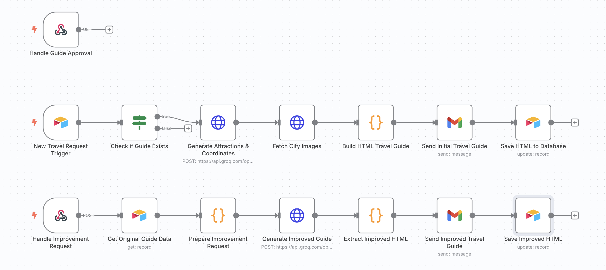
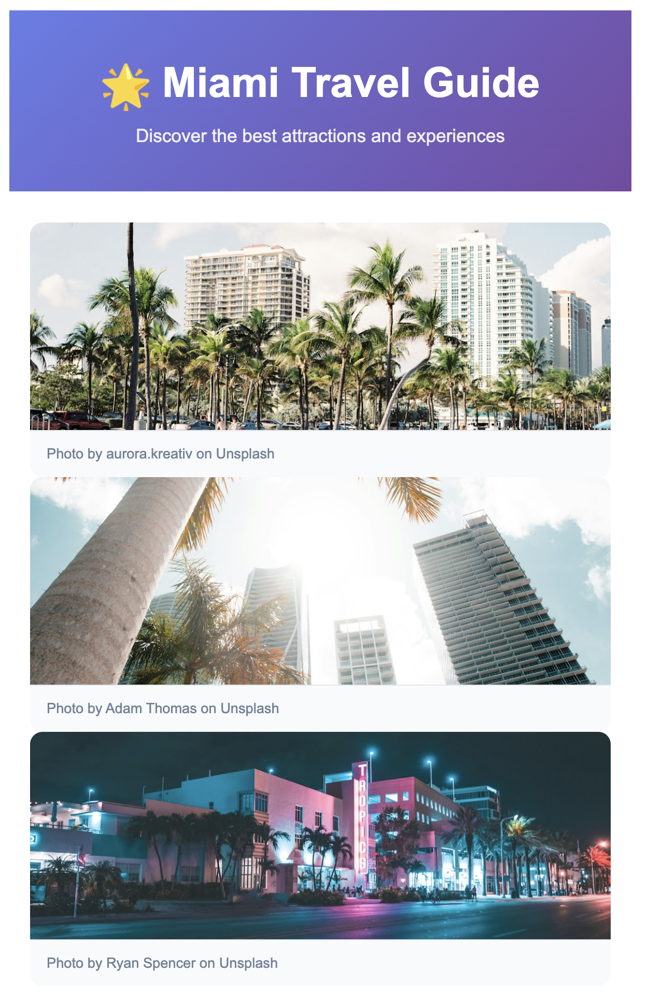
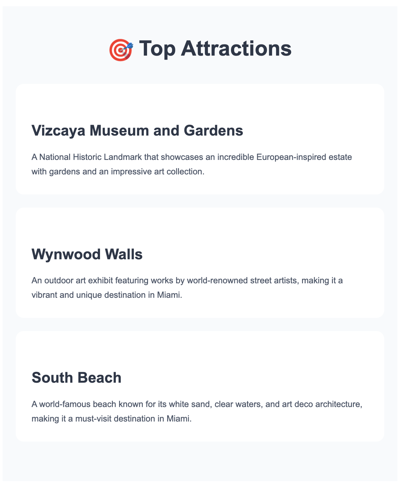
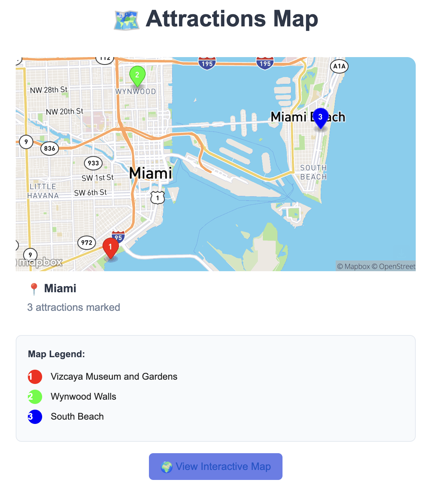

# 🏙️ Quick City Guide - Automation System

An n8n automation workflow that generates quick city guides with 3 top attractions, professional images, and interactive maps with pinpoint locations.

<p align="center">
  
  <br>
  <em>Complete automation workflow with 15 connected nodes across 3 flows</em>
</p>

## ✨ What It Does

- **🤖 AI-Powered Recommendations**: Uses Groq AI to find 3 top attractions with real GPS coordinates
- **📸 Professional Images**: Fetches 3 high-quality city photos from Unsplash API
- **🗺️ Pinpoint Maps**: Creates custom maps with numbered markers using MapBox API
- **📧 Email Delivery**: Sends beautifully designed HTML emails via Gmail
- **🔄 Smart Improvements**: AI-powered enhancement system based on user feedback
- **💾 Automatic Storage**: Saves generated guides in Airtable database
- **📱 Email-Compatible**: Works perfectly across all email clients

## 🎯 How It Works

1. **User Input**: User enters city name and email in Airtable
2. **AI Discovery**: System finds 3 top attractions with real coordinates
3. **Image Collection**: Downloads 3 professional photos of the city
4. **Map Generation**: Builds interactive map with 3 numbered pinpoints
5. **Guide Creation**: Compiles everything into a styled HTML email
6. **Email Delivery**: Sends complete city guide to user
7. **User Feedback**: User can approve or request improvements
8. **Smart Enhancement**: AI improves guide based on specific feedback

## 🏗️ System Architecture

### Main Workflow (7 nodes)
```
Airtable Trigger → Content Filter → AI Generation → Image Fetching → 
HTML Builder → Email Sender → Database Storage
```

### Feedback Workflow (7 nodes)
```
Webhook Handler → Data Retrieval → Request Preparation → 
AI Improvement → HTML Extraction → Email Delivery → Database Update
```

### Approval Workflow (1 node)
```
Simple Webhook Handler (HTML already saved)
```

## 🛠️ Tech Stack

- **Automation Platform**: n8n
- **AI Model**: Groq API (llama-3.3-70b-versatile)
- **Image API**: Unsplash
- **Maps API**: MapBox Static API
- **Email Service**: Gmail API
- **Database**: Airtable
- **Languages**: JavaScript, HTML, CSS

## 📦 Quick Start

### Prerequisites
- n8n instance (cloud or self-hosted)
- API keys for: Groq, Unsplash, MapBox
- Gmail account with OAuth setup
- Airtable base with required fields

### Installation
1. Import `workflow.json` into your n8n instance
2. Configure API credentials
3. Create Airtable table with required schema
4. Update webhook URLs in JavaScript nodes
5. Activate workflow

**📋 For detailed setup instructions, see [SETUP.md](SETUP.md)**

### Airtable Schema
```
City (Single line text)
Email (Email)
HTML_Content (Long text)
Last Modified (Last modified time)
```

## 📸 Screenshots
### Generated City Guide Components

#### Header with photos


#### Attractions List


#### Map with Pinpoints


#### Approval System


## 🔧 Configuration

### API Keys Required
- **Groq AI**: Free tier, 4000 tokens/request
- **Unsplash**: 50 requests/hour (free)
- **MapBox**: 50,000 requests/month (free)
- **Gmail**: OAuth2 authentication
- **Airtable**: Personal Access Token

### Environment Variables
```javascript
// Replace in workflow JavaScript nodes:
MAPBOX_TOKEN = "your_mapbox_token"
UNSPLASH_KEY = "your_unsplash_key"
N8N_WEBHOOK_URL = "your_n8n_instance_url"
```

## 🧪 Testing

### Test Scenario 1: Basic Guide Generation
1. Add record: City="Paris", Email="test@example.com"
2. Wait 30-60 seconds
3. Check email for complete travel guide
4. Verify HTML saved in Airtable

### Test Scenario 2: Improvement System
1. Click "Submit Feedback" in received email
2. Enter: "Change colors to blue and green"
3. Receive improved version
4. Verify updated HTML in database

## 📊 Performance Metrics

- **Response Time**: 15-30 seconds for complete guide
- **Success Rate**: 95%+ (dependent on external APIs)
- **Email Compatibility**: 100% across major clients
- **Coordinate Accuracy**: Real GPS data for each attraction

## 📄 License

MIT License - Feel free to use and modify

## 🤝 Contributing

Pull requests welcome! Please read contributing guidelines.

## 👨‍💻 Author

**Your Name**
- Portfolio: [https://github.com/michaelarie96]
- LinkedIn: [https://linkedin.com/in/michaelarie]
